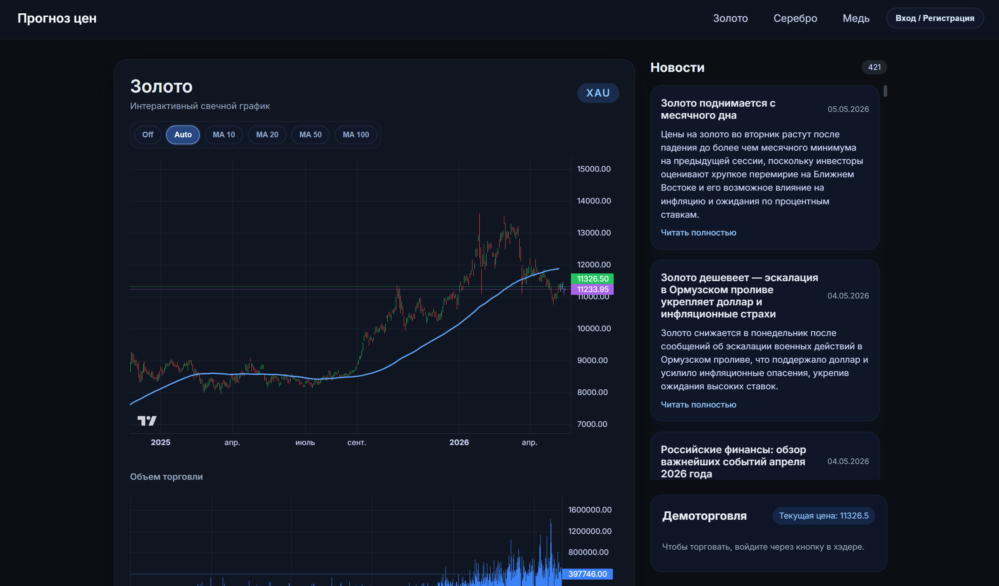
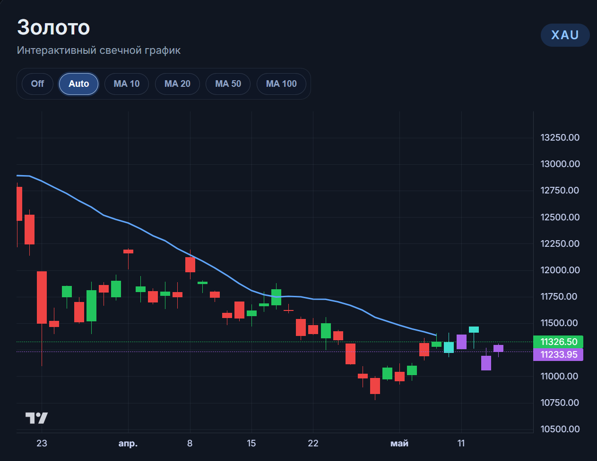

# Прогнозирование цен на драгоценные и промышленные металлы

Проект собирает исторические цены и новости по металлам, хранит данные в БД, а затем строит прогнозы и отображает их в веб-интерфейсе на FastAPI.

## Что есть в проекте

- сбор исторических котировок для золота, серебра и меди;
- сбор новостей и хранение текстов в БД;
- прогнозирование цен с помощью сохранённых LSTM-моделей;
- анализ новостей через SVM-пайплайн сентимента;
- веб-страницы с графиками, новостями и демоторговлей.

## Структура проекта

- `app/` — веб-приложение FastAPI, шаблоны, CSS и JavaScript;
- `db/` — SQLAlchemy-таблицы и функции работы с БД;
- `parser/` — загрузка цен;
- `scraper/` — сбор новостей;
- `predict_model/` — код инференса и сохранённые модели;
- `data/` — CSV-выгрузки;
- `airflow/` — DAG'и для периодического обновления данных.

## Интерфейс

В проекте **нет отдельной админ-панели**. Пользовательский интерфейс состоит из одной основной dashboard-страницы, которая открывается для каждого металла:

- `/` — главная страница, по умолчанию открывает золото;
- `/gold` — золото;
- `/silver` — серебро;
- `/cupp` — медь.

В шапке находятся навигация по металлам и кнопка входа/регистрации. На самой странице отображаются:

- свечной график цены;
- объём торгов;
- RSI;
- прогнозная линия/свечи;
- список новостей;
- блок демоторговли с историей сделок, текущим капиталом и позициями.

### Главная dashboard-страница

На этой странице пользователь видит основную аналитику по выбранному металлу: график, технические индикаторы, прогнозы и новостной фон.



### Страница отдельного металла

Та же dashboard-страница используется для переключения между металлами. Отличается только выбранный инструмент и набор данных.



## Модели и прогнозирование

### 1. LSTM-модель прогноза цен

Основной файл: `predict_model/LSTM.py`

Эта часть проекта отвечает за построение прогноза цен на основе исторических свечей и новостного фона.

Что делает пайплайн:

1. Загружает из БД исторические цены по металлу.
2. Загружает новости и прогоняет их через модель сентимента.
3. Строит набор признаков:
   - `open`, `high`, `low`, `close`, `volume`;
   - размах свечи (`hl_range`);
   - изменение цены (`oc_change`);
   - процентные изменения и momentum;
   - скользящие средние;
   - волатильность;
   - агрегированный сентимент по дням.
4. Берёт последнее окно длиной `timesteps`.
5. Передаёт окно в сохранённую LSTM-модель.
6. Получает прогноз относительного изменения и переводит его обратно в цены.
7. Формирует таблицу будущих дат и записывает прогноз в таблицу прогноза.

Что важно понимать про модель:

- в `predict_model/models/*_lstm_bundle.pkl` лежит не просто сеть, а bundle;
- в bundle хранятся:
  - JSON архитектуры модели;
  - веса модели;
  - scaler для входных признаков (`x_scaler`);
  - scaler для целевых значений (`y_scaler`);
  - размер окна (`timesteps`);
  - горизонт прогноза (`horizon`);
  - список входных признаков и целевых колонок.

То есть инференс устроен как полноценный воспроизводимый pipeline: сначала подготовка признаков, затем нормализация, затем LSTM, затем обратное преобразование прогноза.

### 2. SVM-пайплайн сентимента

Файл артефакта: `predict_model/models/svm_sentiment_pipeline.pkl`

Этот пайплайн нужен для анализа новостей. Его задача — определить настроение текста новости и превратить его в числовой признак для прогноза цен.

Логика использования:

- на вход подаётся текст новости;
- пайплайн преобразует текст во внутреннее представление;
- SVM классифицирует новость как позитивную, нейтральную или негативную;
- результат затем агрегируется по дням и добавляется в признаки LSTM-модели.

Таким образом новости не просто показываются в интерфейсе, а участвуют в прогнозе как дополнительный источник сигнала.

## Данные и база данных

- `db/create_db.py` — создание подключения и engine;
- `db/models.py` — таблицы для:
  - пользователей;
  - демоторговли;
  - исторических цен;
  - новостей;
  - прогнозных цен;
- `db/core.py` — вставка, экспорт в CSV и заполнение таблиц.

## Запуск

```powershell
python -m venv .venv; .\.venv\Scripts\Activate; pip install -r requirements.txt
uvicorn app.main:app --host 0.0.0.0 --port 8000 --reload
```

После запуска откройте:

```text
http://localhost:8000
```

## Тестирование

В проекте уже есть базовые тесты, которые проверяют:

- наличие ключевых файлов;
- наличие моделей;
- работу страниц сайта;
- работу API-эндпоинтов без обращения к реальной БД.

Запуск тестов:

```powershell
pip install pytest
pytest -q tests
```

## Скриншоты

Скриншоты лучше хранить в `docs/screenshots/`.

- `docs/screenshots/home.svg` — главная dashboard-страница;
- `docs/screenshots/metal_page.svg` — та же страница для другого металла.

Если скриншотов ещё нет, оставьте эти файлы-заглушки и замените их позже на реальные изображения.

